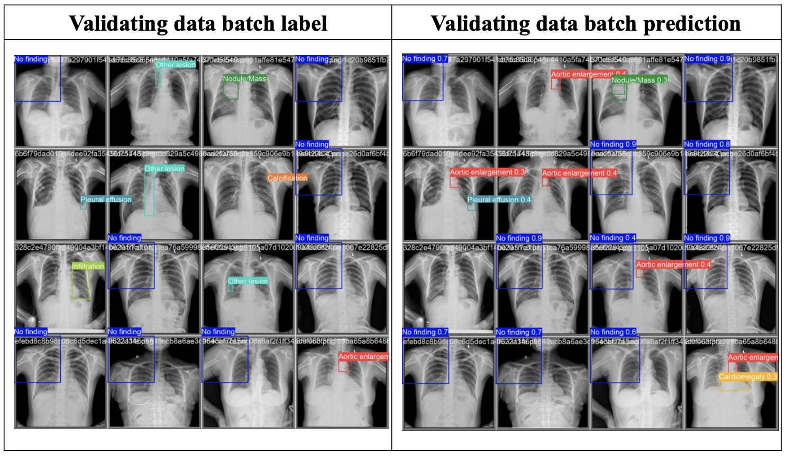

# YOLOV5: VinBigData Chest X-ray Abnormalities Detection

This project focuses on automatically localizing and classifying thoracic abnormalities from chest radiographs. It is based on the VinBigData Chest X-ray Abnormalities Detection competition from Kaggle.

## Project Overview
The goal of this project is to develop a model that can localize and classify 14 types of thoracic abnormalities from chest radiographs using machine learning techniques. By working with a large dataset of X-ray images (DICOM format), this project applies deep learning methods to help improve the accuracy and speed of diagnostic imaging.

[Kaggle Competition Link](https://www.kaggle.com/c/vinbigdata-chest-xray-abnormalities-detection/overview)

## Dataset Information:
The dataset consists of 18,000 X-ray scans that have been annotated by experienced radiologists.
The model is trained, validated, and tested on 15,000 independently labeled images.
The dataset includes 14 categories of thoracic abnormalities.
File Format:
The X-ray images are stored in the DICOM format, which is a standard format for storing medical images.
Methodology
Data Preprocessing:

Convert DICOM images to PNG for improved processing efficiency.
Prepare the YOLOv5 model with proper annotations in .txt format to match the YOLO format.
## Model:

The project uses the YOLOv5 architecture, which is known for its speed and accuracy in real-time object detection. YOLOv5 divides the input image into a grid and predicts bounding boxes along with their class probabilities.
The YOLOv5x and YOLOv5s model variants are trained and evaluated with varying parameters such as batch size and the number of epochs.
Training Setup:

Training is conducted on Google Colab using GPU resources, specifically the NVIDIA Tesla V100.
The dataset is split into training, validation, and testing sets to evaluate model performance.
Performance Evaluation:

Metrics such as mean Average Precision (mAP), Precision, and Recall are used to evaluate the model’s performance.
Model results are further analyzed using confusion matrices and loss curves.

## Results
YOLOv5x Model (Batch size: 16, Epochs: 30) achieved an mAP of 39.2% and Precision of 52%.
YOLOv5x Model (Batch size: 16, Epochs: 40) achieved an improved mAP of 49.2% and Precision of 66.3%.
YOLOv5s Model (Batch size: 16, Epochs: 30) achieved lower performance with an mAP of 26% and Precision of 54.9%.

## Future Work
Explore hyperparameter tuning to improve model accuracy.
Use a more diverse dataset to balance class representation.
Leverage more computational resources for larger models like YOLOv5x to improve training efficiency.
